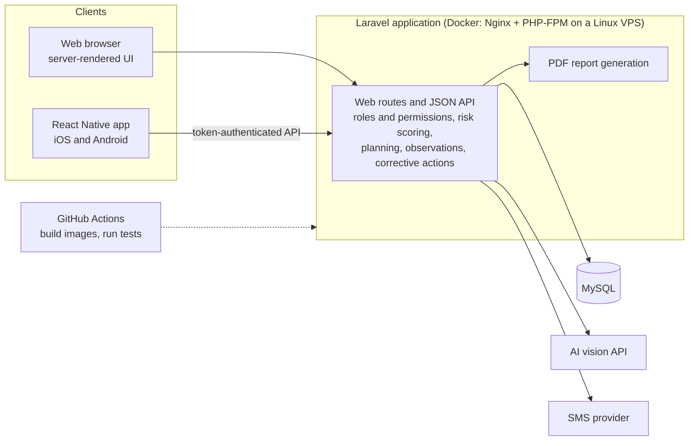
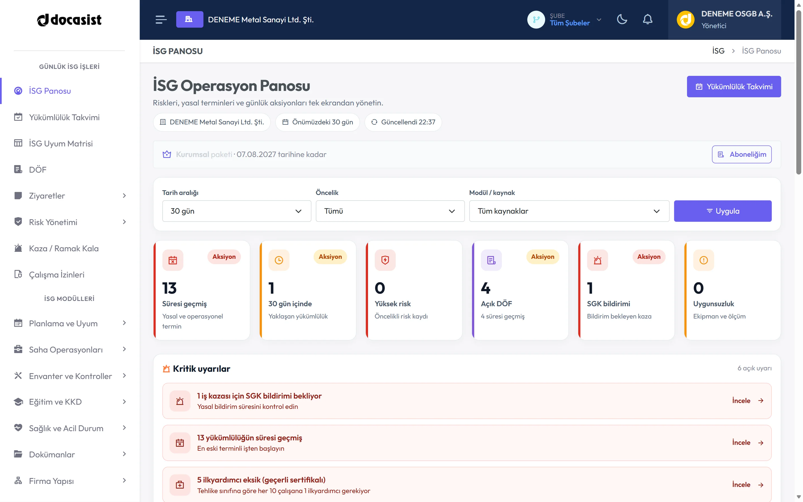
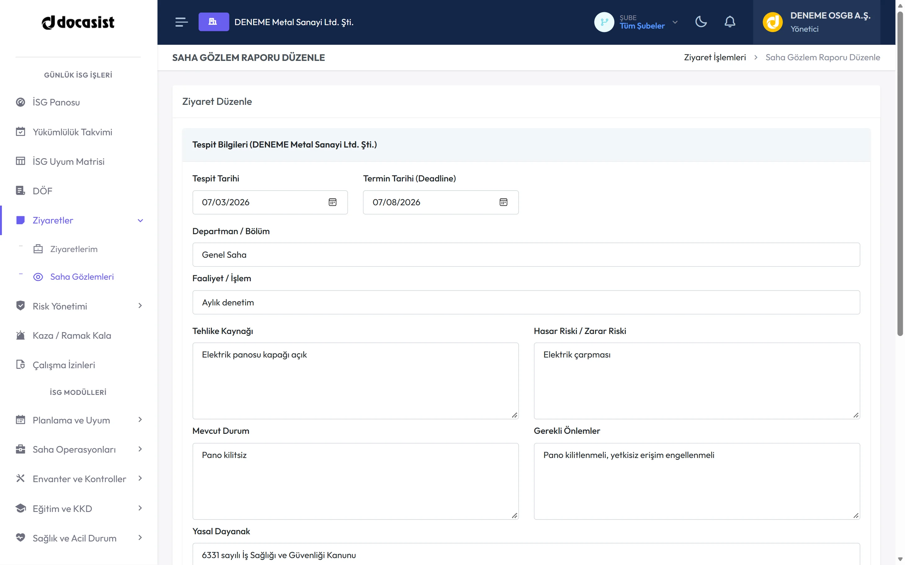
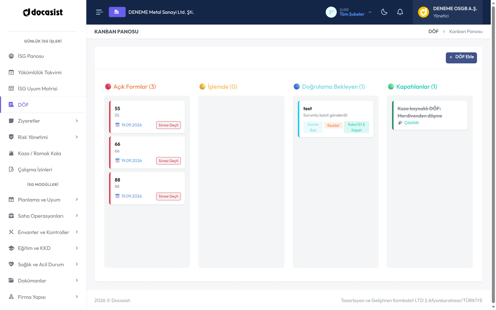
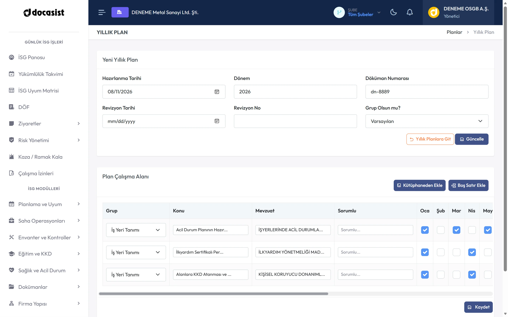
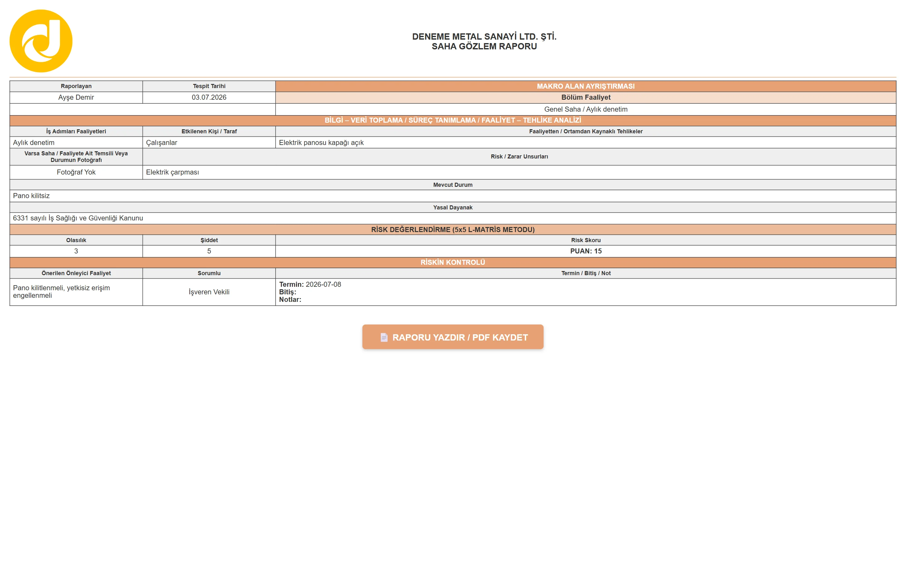

# Docasist

Docasist is an occupational health and safety (OHS) operations platform, live in production, that lets safety organizations run risk analyses, annual plans, field observations and corrective actions from a web application and a mobile app.

> [!IMPORTANT]
> **Proprietary case study.** Docasist is a commercial product developed at Kombobit. This repository is a technical portfolio case study written by one member of the development team. It contains no source code. The production codebase is proprietary and is not included here.

## Quick facts

| Fact | Detail |
|---|---|
| Product type | Commercial occupational health and safety operations platform |
| Status | Live in production |
| My role | Full-stack and mobile software developer, part of a small team |
| Organization | Kombobit |
| Platforms | Web application, iOS and Android (React Native) |
| Website | [docasist.com](https://docasist.com) |

## Product overview

Docasist is used by occupational health and safety organizations (in Turkey these service providers are known as OSGBs) to manage the safety work they carry out for the workplaces they are responsible for. It brings the recurring parts of that work into one system: assessing and scoring risks, planning the year, visiting sites, recording observations, tracking corrective actions to closure, and producing the reports that document all of it.

The web application is where planning, reporting and administration happen. The React Native mobile app is oriented towards field use, such as recording observations and capturing photos on site. Both run on the same Laravel backend and the same MySQL database, which has grown to roughly 73 tables to represent the domain.

## The problem Docasist addresses

OHS work is structured and repetitive by nature. A safety professional assesses risks at a workplace using a recognized scoring method, plans a year of activities, visits sites on a schedule, notes what they see, assigns corrective actions to someone, follows those actions until they are closed, and produces documentation at each step.

When these steps live in separate spreadsheets, documents and messaging threads, the same information gets typed several times, scoring is applied inconsistently between people, and follow-up is easy to lose. Docasist keeps these workflows in a single system with a shared data model, so an observation recorded on site becomes a tracked finding, a finding becomes a corrective action with an owner, and the reports are generated from the same records rather than reassembled by hand.

## My role and responsibilities

I worked on Docasist as a full-stack and mobile developer within a small team at Kombobit. The product was designed and built by that team. The points below describe my own contributions, not the whole product.

- **Laravel backend development.** Implemented and maintained backend functionality, including work on [ADD VERIFIED INFORMATION: the modules you worked on most, for example field observations, risk analysis or annual planning].
- **React Native mobile application.** Contributed to the TypeScript codebase of the mobile app and to its integration with the backend API.
- **Relational data model.** Worked day to day with a large MySQL schema covering organizations, risk analyses, plans, visits, observations, findings and corrective actions.
- **Third-party integrations.** Helped implement and maintain the integrations for AI-assisted image analysis, SMS delivery and PDF report generation.
- **Builds and releases.** Supported production builds and releases, including the Docker-based deployment workflow and mobile releases to the App Store and Google Play.

Period of involvement: [ADD VERIFIED INFORMATION]. Team size: [ADD VERIFIED INFORMATION].

## Key product capabilities

- **Risk analysis with two scoring methods.** Risks are assessed with either the L-Matrix (probability and severity matrix) or the Fine-Kinney (probability, exposure and consequence) method, so organizations can work with the method they already use.
- **Annual planning.** Yearly plans of activities and trainings for each workplace, with detail records that can be tracked through the year.
- **Field observation reports.** Observations recorded during site visits, each of which can hold multiple findings.
- **Corrective action tracking.** Findings turn into corrective actions that are assigned and followed until they are closed.
- **AI-assisted hazard identification.** A photo taken on site can be sent to a vision-capable language model, which returns potential hazards for a safety professional to review.
- **PDF reports.** Reports are generated server-side as PDF documents from the same records that appear in the application.
- **SMS integration.** Used for verification codes and for operational notifications, for example when observations or corrective actions need someone's attention.
- **Roles and permissions.** Multiple user roles with role-based access control, and data scoped to the organization a user belongs to.
- **Mobile app for iOS and Android.** A React Native application published on the App Store and Google Play, working against the same backend as the web application.

## High-level technical architecture

Docasist is a single Laravel application that serves two kinds of clients. The web application is rendered server-side with Blade templates. The React Native mobile app talks to a token-authenticated JSON API exposed by the same application. Both share one MySQL database and the same domain logic, so a risk score or a corrective action means the same thing wherever it is displayed.

External services are called from the Laravel application: a vision-capable AI API for image analysis, an SMS provider for messages, and an HTML-to-PDF renderer for reports.

In production the application runs as Docker containers (Nginx in front of PHP-FPM) on a Linux VPS. GitHub Actions builds the container images and runs the automated test suite.

The diagram is intentionally conceptual. It omits infrastructure details such as hosts, networks and internal service names.

## Important engineering challenges

### Representing a complex occupational-safety domain

The domain has many entities that are related but distinct: organizations and their workplaces, hazard sources, risk analyses and the templates they are built from, annual plans and their detail lines, site visits, observations, findings, corrective actions, and users who play different roles in each of these. A large part of the work is keeping names and relationships aligned with how safety professionals actually describe their work, so that the database, the screens and the reports all tell the same story.

### Managing a large relational data model

With around 73 tables, a change to one entity rarely stays local. It touches validation rules, forms, API responses and report templates. Working in this schema means being deliberate about migrations and relationships, and paying attention to how queries behave on list and report pages where many related records are loaded at once.

### Keeping risk-scoring workflows understandable and consistent

L-Matrix and Fine-Kinney take different inputs and produce scores on different scales, and each score has to be classified into a risk level in a way that is reproducible. The same analysis must show identical results in the web application, in the mobile app and in the generated PDF. The challenge is to keep the calculation explicit and testable rather than spread across views.

### Coordinating web and mobile functionality

One backend serves both clients, so API changes have to be compatible with mobile versions that are already installed and cannot be updated instantly. Field use also has different constraints from office use: smaller screens, photos as primary input and occasionally poor connectivity. Deciding which features belong on mobile, and how their data maps onto the shared model, is an ongoing coordination effort.

### Processing images through an AI-assisted workflow

Photos from the field are sent to a vision-capable model with a prompt framed in OHS terms, and the response is turned into candidate hazards. The practical concerns are image size and encoding, response latency in a mobile flow, and handling responses that are not in the expected shape. Model output has to be treated as a suggestion for a safety professional to review, not as a finding in itself.

### Producing consistent PDF reports

Reports are rendered from HTML templates to PDF on the server. HTML-to-PDF rendering supports only part of CSS, so layouts have to be built with page breaks, long tables and fonts that cover the full character set of the product's language in mind. Keeping several report types visually consistent while their content differs takes deliberate template structure.

### Managing role-based access

Users have different roles, and each role sees and does different things. On top of role permissions, records are scoped to the organization they belong to, and that scoping has to hold in both the web routes and the API. Automated tests cover record-level ownership scoping so that regressions in access control are caught before release.

### Delivering and maintaining production mobile releases

The mobile app is built with React Native CLI, so native iOS and Android builds, signing, versioning and store review are part of the delivery work. Each release has to remain compatible with the current backend, and backend changes have to be sequenced so that older app versions keep working until users update.

## Technical decisions and trade-offs

**One Laravel application for web and API.** The web UI and the mobile API share one codebase, one set of models and one deployment. This keeps domain logic in a single place and avoids drift between the two clients. The trade-off is that the API and the web application are released together, so API changes need care to stay compatible with installed mobile versions.

**Server-rendered web UI.** The web application uses Blade templates with Bootstrap and page-level JavaScript rather than a single-page frontend. For an application that is largely forms, lists and reports, this is fast to build and has few moving parts. The cost is less client-side interactivity where a screen would benefit from it.

**React Native CLI rather than Expo.** Using the CLI gives direct control over native project configuration and native dependencies. In exchange, the team owns more of the build tooling and upgrade work.

**HTML-to-PDF for reports.** Rendering PDFs from HTML templates lets report layouts reuse the same templating approach as the rest of the application, and lets developers iterate on reports as web pages. The trade-off is limited CSS support and layout constraints, which shape how templates are written.

**A permission package plus organization scoping.** Roles and permissions are handled with an established Laravel permission package, and record-level scoping is applied on top. Reusing a well-known package reduces custom authorization code, while the scoping layer carries the multi-organization requirement that the package alone does not cover.

**Docker images built in CI, deployed to a Linux VPS.** Building Nginx and PHP-FPM images in GitHub Actions and running them on a VPS gives reproducible deployments with simple operations. It suits the product's current scale; horizontal scaling or high availability would need additional infrastructure work.

## Screenshots and product walkthrough

All screenshots below use sanitized or demonstration data. No customer information is shown.

|  |  |
|:--:|:--:|
| **Web dashboard.** The starting point for office-side work: an overview of the organization's current safety activity, from which planning, analyses and reports are reached. | **Risk analysis on mobile.** A risk analysis being worked on in the React Native app, showing how scoring inputs are captured on a small screen. |
|  |  |
| **Field observation.** An observation recorded during a site visit, with its findings and attached photos. This is the entry point for the finding-to-action flow. | **Corrective action tracking.** Corrective actions with owners, due dates and status, showing how findings are followed until they are closed. |
|  |  |
| **Annual plan.** A yearly plan for a workplace with its detail lines, showing how planned activities are laid out and tracked over the year. | **Generated report.** A PDF report produced by the system from the same records shown in the application, demonstrating the server-side report layout. |

[ADD SCREENSHOT: AI-assisted hazard identification, showing a photo and the suggested hazards returned for review]

## Technology stack

| Responsibility | Technology |
|---|---|
| Backend application and API | PHP 8.3, Laravel [VERIFY VERSION: brief says Laravel 11; composer.json currently declares ^13.0], Laravel Sanctum for API token authentication |
| Web UI | Blade templates, Bootstrap 5, Vite |
| Mobile application | React Native CLI, TypeScript |
| Database | MySQL |
| Authorization | Role and permission management (spatie/laravel-permission) with organization-level data scoping |
| AI image analysis | Vision-capable language model API [VERIFY PROVIDER: OpenAI API or Google Gemini] |
| PDF generation | HTML-to-PDF rendering with DomPDF |
| Messaging | SMS provider integration |
| Infrastructure | Docker (Nginx and PHP-FPM containers), Linux VPS |
| CI | GitHub Actions: container image build and push, automated PHPUnit test runs |

## Delivery and deployment responsibilities

- **Containerized deployment.** The application is packaged as separate Nginx and PHP-FPM Docker images and runs with Docker on a Linux VPS. I contributed to the Docker build and deployment workflow.
- **Continuous integration.** GitHub Actions builds the container images and pushes them to a container registry, and a separate workflow runs the PHPUnit test suite on pushes and pull requests. I worked with these workflows as part of day-to-day delivery.
- **Mobile releases.** I contributed to producing and releasing iOS and Android builds of the React Native app through the App Store and Google Play, including the versioning and compatibility work that comes with store releases.

## Outcomes and current status

- Docasist is live in production at [docasist.com](https://docasist.com) and in active use by occupational health and safety organizations.
- The mobile application is published on the App Store and Google Play.
- The platform is maintained and developed further by the team at Kombobit. [ADD VERIFIED INFORMATION: whether you are still contributing, and any usage figures Kombobit permits you to share]

No user, revenue or performance figures are published in this case study.

## What I learned

- **Model the domain in the users' language.** In a domain as structured as OHS, the data model is the product. Time spent getting entity names and relationships right paid off in every screen and report built on top of them.
- **A shared backend for web and mobile is a compatibility contract.** Once the mobile app was in the stores, every API change had to consider versions I could not force users to update. That changed how I thought about response shapes and deprecation.
- **AI output is an input, not a result.** Building the image analysis flow made it clear that model responses need validation, graceful handling of unexpected output, and a UI that presents them as suggestions for a professional to judge.
- **PDF rendering is a design constraint, not a formatting step.** Report templates have to be written with the renderer's limits in mind from the start. Retrofitting a web layout into a paginated PDF is much harder than designing for it.
- **Access control needs tests.** Role checks and organization scoping are easy to get subtly wrong across many routes. Automated tests for ownership scopes caught problems that manual testing would have missed.
- **Releases are part of the feature.** Docker builds, CI and store submissions are where a change actually reaches users. Understanding that pipeline made me a more useful member of a small team.

## Links

- Product website: [docasist.com](https://docasist.com)
- iOS app on the App Store: [ADD VERIFIED INFORMATION: App Store link]
- Android app on Google Play: [ADD VERIFIED INFORMATION: Google Play link]
- Kombobit: [ADD VERIFIED INFORMATION: company website]
- My profile: [ADD VERIFIED INFORMATION: GitHub or LinkedIn link]

## Ownership and confidentiality notice

Docasist is a commercial product owned and developed by Kombobit. This repository is a personal technical case study describing my contributions as a developer on the team. It is not affiliated with, and does not represent, the official Docasist project.

The production source code is proprietary and is not included in this repository. This repository does not contain database schemas, API definitions, credentials, infrastructure details or customer data. Screenshots use sanitized or demonstration data only.

This repository is not open source. No license is granted for the reuse of its contents. Product names and trademarks belong to their respective owners.
